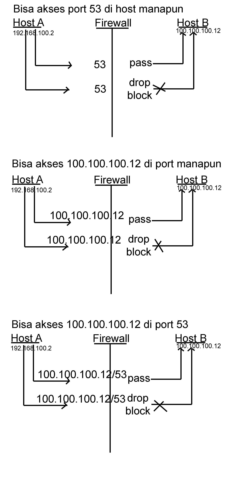

**Rangkuman Pertemuan 7 Sistem Keamanan Jaringan**

  

Latar Belakang

1. Apa yang dimaksud dengan Firewall?
2. Bagaimana cara kerja firewall?
3. Bagaimana alur dari firewall?
4. Apa saja perangkat firewall?

Firewall adalah aturan didalam sebuah sistem operai yang berfungsi untuk mengatur paket yang dating dan pergi dari suatu jaringan seperti layaknya pintu yang bisa dibuka dan ditutup

Cara kerja firewall itu bergantung dengan berdasarkan IP dan Port yang terdiri dari 3 kategori kerja yaitu

- --Pass        : membolehkan paket untuk lewat
- --Drop         : melarang paket untuk lewat, tetapi tidak diberitahu pengirim bahwa paket tidak lewat
- --Block        : melarang paket untuk lewat, tetapi memberitahu pengirim bahwa paketnya dilarang untuk lewat

Alur

  

Perangkat firewall ada 2 kategori yaitu hardware dan software, untuk hardware seperti mikrotik, cisco, fortiqure dal lain –lain. Sedangkan untuk software seperti bawaan OS (Windows Firewall, IPTables), OS khusus firewall (PFSense, hidrotik)

Penutup
Kesimpulan
Dari pernyataan diatas dapat disimpulkan bahwa firewall adalah suatu alat untuk melakukan pengamanan komputer dari komputer yang jail dengan memblock IP yang dia punya agar tidak bisa mengakses

Saran
Sebaiknya keamanan firewall terus di upgrade agar komputer kita aman dan bisa mem block IP dari komputer yang tidak diinginkan

* Nama : Gilang Romadhanu Tartila
* NPM : 1144033
* Kelas : 3C
* Prodi : D4 Teknik Informatika
* Mata Kuliah : Sistem Keamanan Jaringan

Link Github : https://github.com/gilangtartila99/SistemKeamananJaringan2016

Referensi : 

1. https://id.wikipedia.org/wiki/Tembok_api

Scan Plagiarisme

1. smallseotools - Link https://drive.google.com/open?id=0B5gySyqZ4GGoX2V3a3RtZkdPN1U
2. searchenginereport - Link https://drive.google.com/open?id=0B5gySyqZ4GGodzI1eUlOOV9MYWs