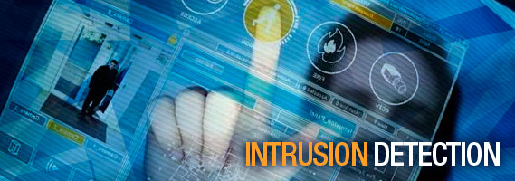

**Rangkuman Pertemuan 9 Sistem Keamanan Jaringan**

  

Rangkuman Pertemuan 9 Sistem Keamanan Jaringan

Latar Belakang

1. Apa yang dimaksud IDS(Instrusion Detection System)
2. Apa perbedaan IDS dan IPS?
3. Bagaimana urutan kinerja IDS dan IPS?
4. Apa fungsi dari HIDS(Host Instrusion Detection System) dan NIDS(Network Instrusion Detection System)?

IDS(Instrusion Detection System) merupakan sebuah perangkat yang berisi beberapa rule/aturan untuk dibuat log-nya. Biasanya rule ini senantiasa diupdate seperti anti virus

Perbedaan antara IDS dan IPS terletak pada fungsinya, IDS berfungsi untuk membuat log/alert sedangkan IPS berfungsi untuk memblock

Urutan kinerja dari IDS dan IPS terdiri dari:

1. IDS

- --Datang traffic tak biasa
- --IDS meneteksi traffic tersebut sam dengan rule yang didirikan
- --IDS membuat log alert bahwa ini sesuai dengan salah satu rule

1. IPS

- --IPS memblock traffic tersebut

Fungsi dari HIDS dan NIDS terdiri dari :

1. HIDS berfungsi untuk memonitoring meta data dari berkas yang ada di komputer(localhost)
2. NIDS berfungsi untuk memonitoring jaringan internet

* Nama : Gilang Romadhanu Tartila
* NPM : 1144033
* Kelas : 3C
* Prodi : D4 Teknik Informatika
* Mata Kuliah : Sistem Keamanan Jaringan

Link Github : https://github.com/gilangtartila99/SistemKeamananJaringan2016

Referensi : 

1. https://id.wikipedia.org/wiki/Sistem_deteksi_intrusi

Scan Plagiarisme

1. smallseotools - Link https://drive.google.com/open?id=0B5gySyqZ4GGoUkFkYkphckwzTEE
2. duplicheker - Link https://drive.google.com/open?id=0B5gySyqZ4GGoblVsUEpnb1JDWDg